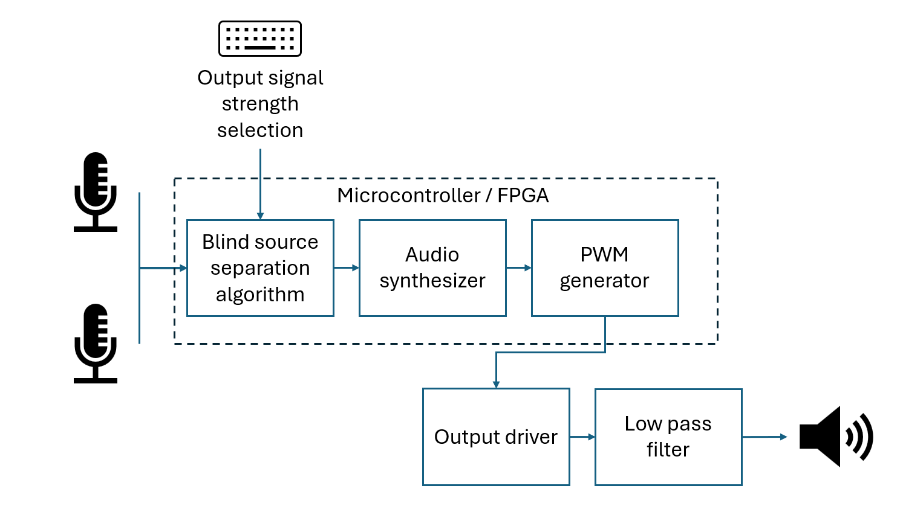
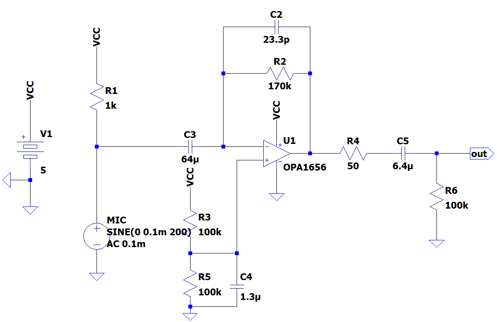
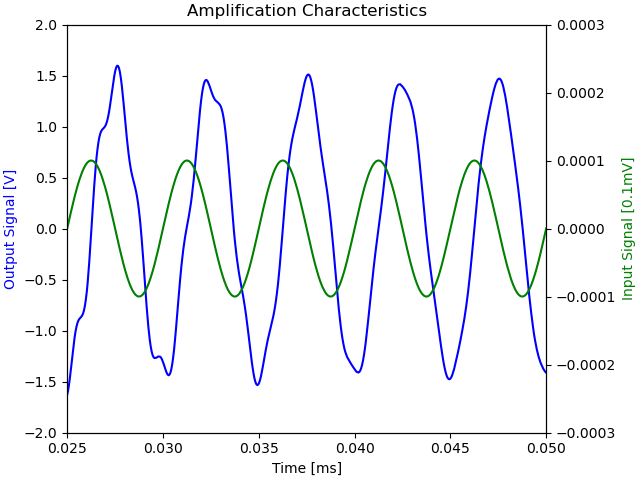
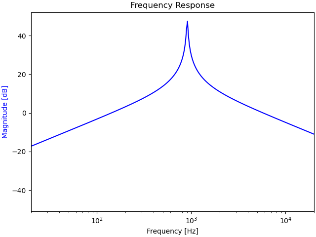
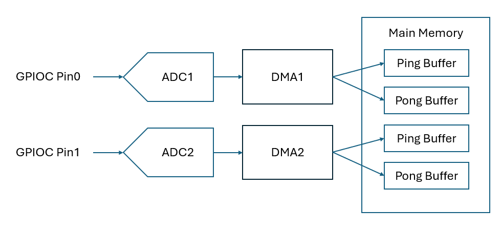

# BSS_Microphone_System

System implementation of the Blind Source Separation Algorithm using a dual microphone connected to a microcontroller and speaker.

Updated: 2/8/2025

---

## System Description

The two microphones will take in sound from different sources. For example, sound taken from inside of the vehicle and from outside of the vehicle. 
The two audio signals will be used as input to the Blind Source Separation (BSS) algorithm and audio synthesizer to generate a single output audio signal. 
The output signal will be a synthesized signal of the two inputs. The weight of each input to the output signal will be determined by input to the microcontroller. 
The output signal will then pass a Pulse Width Modulation (PWM) generator to be converted to a pulse wave that will pass through an output driver and low pass filter to a earphone jack.
System testing and verification will be done using a microcontroller. Once tested, the BSS algorithm, audio synthesizer, and PWM signal generator will be implemented using a FPGA.  

## Table of Contents

[Microphone Module](https://github.com/CalvinFetzek50/BSS_Microphone_System/tree/main?tab=readme-ov-file#microphone-module)

[Analog to Digital Converter(ADC)](https://github.com/CalvinFetzek50/BSS_Microphone_System/tree/main?tab=readme-ov-file#analog-to-digital-converter-adc)

[Speaker Module](https://github.com/CalvinFetzek50/BSS_Microphone_System/tree/main?tab=readme-ov-file#speaker-module)

## Microphone Module

1. **Schematic**

    The schematic of the microphone module is shown below.
    It is based on a microphone pre-amplifier reference design.
    It is designed to take a 5V single source power supply and output a
    $1.228V_{rms}$ amplified line level audio signal to the microcontroller pin.

    

2. **Simulation Output**

    The circuit was simulted using LTSpice.
    Transient analysis show the input voltage in the mV range being amplified to the designed levels of $1.228V_{rms}$.

    

    The frequency response show a band limited filter where low frequencies of less than 20Hz and high frequencies of more than 20kHz are effetively attenuated.

    

3. **Component Selection and Calculation**

    - **CMA-6542PF Electrec Microphone**

        This microphone has a good signal to noise ratio of 68dBs and its operating frequency of Max 20kHz is sufficient to record sounds in the audible freqeuncy range.

        | Parameter | Value | Units |
        | ----------- | ----------- |----------- |
        | Sensitivity | -42 | dbV |
        | Operating Voltage  | 4.5 | V |
        | Max Current Consumption  | 0.5 | mA |
        | Impedance  | 2.2 | $k\mathsf{\Omega}$ |
        | Signal to Noise Ratio  | 68 | dB |

    - **Resistor and Capacitor Selection**

        - Resistor R1

            The value of R1 was computed based on the operating voltage of the microphone nad max current consumption:

            $ R_1 = \frac{V_{cc}-V_{MIC}}{I_{max}}$

            $ R_1 = \frac{5V-4.5V}{0.5mA} = 1k\Omega $

        - Resistor R2

            First converted the sensitivity to mV/Pa as the microphone sensitivity is given as a dB value relative to 1 Pascal:

            $10^{\frac{-42dB}{20}} = 7.94mV/pa$

            Next, computed the output current of the microphone assuming a 2.2k ohm test impedance to measure its specification:

            $ \frac{7.94mV}{2.2k\Omega} = 3.61\mu A/Pa$

            Next, get the microphone ouput current given a maximum sound pressure of 100dB SPC (2 Pascal):

            $ 3.61\mu A/Pa*2pa = 7.22\mu A$

            Finally, get the required resistance achieving a $V_{out}$ of $1.228V_{rms}$ using the gain calculation of a transimpedance amplifier: 

            $ R_2 = \frac{V_{out}}{I_{in}}$

            $ R_2 = \frac{1.228V}{7.22\mu A} = 170k\Omega$

        - Resistors R3 and R5

            R3 and R5 were set as $100k\Omega$ each to divide the voltage to the non-inverting pin of the op-amp in half.

        - Resistors R4 and R6

            R4 and R6 form a AC cuppling network with capacitor C5. R4 was set to $50\Omega$ to limit the current in the capacitor in cases where a different DC voltage is connected to the output pin and R6 was set to $100k\Omega$ as a typical discharge pathway resistor.  

        - Capacitor C2

            The capacitor forms the pole in the frequency reponse of the pre-amplifier. Therefore, set the pole to a frequency high enough (-3dB at 40kHz) to prevent impact to  frequency range of 20Hz to 20kHz. The location of the pole was computed using:

            $ f_{pole} = \frac{f_{cutoff}}{\sqrt{(\frac{G_{low}}{G_{f}})^2}-1}$

            $ G_{f} = 10^{\frac{-3dB}{20}} = 0.708$

            $ f_{pole} = \frac{40kHz}{\sqrt{(\frac{1}{0.708})^2}-1} = 40.1kHz$

            Based on the pole above, the feedback capacitor value was calculted:

            $ C_2 = \frac{1}{2\pi f_{pole} R_2}$

            $ C_2 = \frac{1}{2\pi (40.1kHz) (170k\Omega)} = 23.3pF$

        - Capacitor C3

            C3 forms a high pass filter with R1. Capacitance was determined based on a cutoff frequency of 2.5Hz using:

            $ C_3 = \frac{1}{2\pi f_{cutoff} R_1}$

            $C_3 = \frac{1}{2\pi (2.5Hz) (1k\Omega)} = 64\mu F$

        - Capacitor C4

            C4 is used to filter noise from the voltage divider circuit (R3 / R5). By setting the cutoff frequency to 2.5Hz, capacitance was computed as:

            $ C_4 = \frac{1}{2\pi f_{cutoff} (R_3||R_5)}$

            $ C_4 = \frac{1}{2\pi (2.5Hz)(50k\Omega) } = 1.3\mu F$

        - Capacitor C5

            C5 and R6 form a high-pass filter. Assuming an input impedance of $10k\Omega$ connected to the output pin, capacitance was selected to avoid excess attenuation at low frequencies by setting the cutoff frequency to 2.5Hz.

            $ C_5 = \frac{1}{2\pi (2.5Hz) (10k\Omega)} = 6.4\mu F$

4. **Reference**

    [Single-Supply, Electret Microphone Pre-Amplifier Reference Design by John Caldwell](
    https://www.ti.com/lit/ug/tidu765/tidu765.pdf?ts=1737720645372&ref_url=https%253A%252F%252Fwww.google.com%252F)

    [OPA1656 Audio Operational Amplifiers](https://www.ti.com/product/OPA1656#design-development)

    [CMA-6542PF Electret Condenser Microphone](https://www.sameskydevices.com/product/resource/cma-6542pf.pdf)

5. **Measurements using a Breadboard**

## Analog to Digital Converter (ADC)

1. **Configurartion**

    The ADC will be set up to use direct memory address (DMA) to store signals in the ADC register to the main memory. This reduces CPU usage when recording data from the microphone. It wall also implement ping-pong buffering, which uses two buffers to overlap data transfer and data processsing. This further reduces CPU usage as it allows the processor more time to process data without pausing ADC conversion. The system architecture is shown below.

    

    STM32L476RGTX development board was used for the prototyping. The ADC / DMA cnofiguration is done through the STM32L4 Hardware Abstraction Layer (HAL).  

2. **Reference**

    Yifeng Zhu. (2018). Embedded Systems with ARM Cortex-M Microcontrollers in Assembly Language and C. Third Edition, (pp. 481-500). E-Man Press.  

## Speaker Module

1. **Schematic**

2. **Simulation Output**

3. **Component Selection and Calcualtions**

4. **Reference**