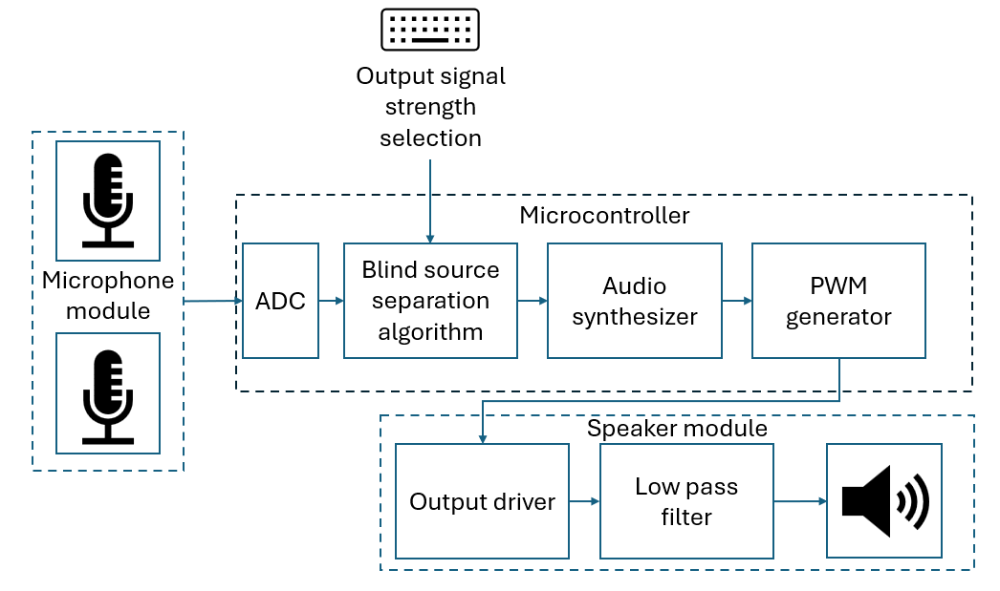

# BSS_Microphone_System

System implementation of the Blind Source Separation Algorithm using a dual microphone connected to a microcontroller and speaker

---

## System Description

The two microphones will take in sound from different sources. For example, sound taken from inside of the vehicle and from outside of the vehicle. 
The two audio signals will be used as input to the Blind Source Separation (BSS) algorithm and audio synthesizer to generate a single output audio signal. 
The output signal will be a synthesized signal of the two inputs. The weight of each input to the output signal will be determined by input to the microcontroller. 
The output signal will then pass a Pulse Width Modulation (PWM) generator to be converted to a pulse wave that will pass through an output driver and low pass filter to a earphone jack.
System testing and verification will be done using a microcontroller. Once tested, the BSS algorithm, audio synthesizer, and PWM signal generator will be implemented using a FPGA.  

## Microphone Module

1. Schematic

2. Simulation Output

3. Bill of Materials

4. Component selection and calculation

    - CMA-6542PF Electrec Microphone

    This microphone has a good signal to noise ratio of 68dBs and its operating frequency of Max 20kHz is sufficient to record sounds in the audible freqeuncy range.

    | Parameter | Value | Units |
    | ----------- | ----------- |----------- |
    | Sensitivity | -42 | dbV |
    | Operating Voltage  | 4.5 | V |
    | Max Current Consumption  | 0.5 | mA |
    | Impedance  | 2.2 | k $\mathsf{\Omega}$ |
    | Signal to Noise Ratio  | 68 | dB |

5. Reference

[Single-Supply, Electret Microphone Pre-Amplifier 
Reference Design by John Caldwell](
https://www.ti.com/lit/ug/tidu765/tidu765.pdf?ts=1737720645372&ref_url=https%253A%252F%252Fwww.google.com%252F)
